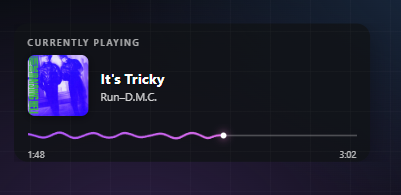
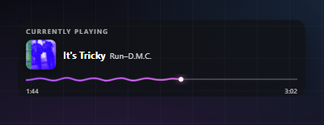
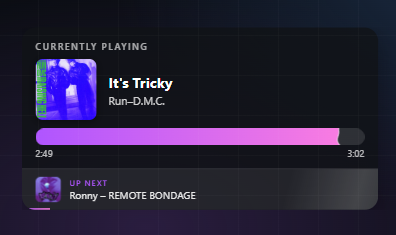
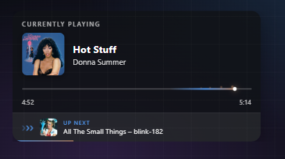

# nowplaying-overlay

Shows the Spotify track you're currently listening to as a browser-source overlay for OBS. Runs as a small local server: connect Spotify once, style the widget on a config page with live preview, paste the generated URL into OBS.

The widget shows title, artist, cover art and a progress display in five styles (animated line, static line, comet, liquid, bar waveform), colored with a gradient pulled from the album cover. Optional extras: an animated "Up Next" banner a few seconds before the song ends, track-change animations, a compact single-line mode, and a configurable background color with opacity. The config page is available in English and German.

## Requirements

- A Spotify account. Two things need Premium: the "Up Next" banner (the queue endpoint is Premium-only), and creating the API app itself — since Spotify's 2026 developer-mode changes, the account that owns the app must be Premium.
- Your own Spotify API app (free, takes two minutes — see below). Spotify limits apps in development mode to a handful of users, so everyone runs their own; that's why the setup asks for a client ID instead of shipping one.

## Quick start

**Without installing anything:** grab the zip for your OS from the [releases page](../../releases), unzip, run `nowplaying` (or `nowplaying.exe`), then open http://127.0.0.1:8976.

**From source:** with [Bun](https://bun.sh) it's `bun install && bun start`. With Node 22.18 or newer it's `npm install && npm run start:node`. Same server either way.

## Examples

| | |
|---|---|
|  Default look — animated line, cover on the left |  `?compact=1` — single line, smaller cover |
|  `?style=liquid&next=15` — liquid fill, "Up Next" with countdown |  `?style=comet&animstyle=arrows&next=15` — comet trail, chevrons pulsing toward the next track |

## Connect Spotify

1. Create an app at https://developer.spotify.com/dashboard
2. Add `http://127.0.0.1:8976/callback` as its redirect URI
3. Open http://127.0.0.1:8976, paste the app's client ID, click connect

Tokens are stored in `data.json` next to the server. Delete the file to disconnect. The overlay shows whatever plays on your account, regardless of device.

## Add to OBS

Copy the overlay URL from the config page and add it as a browser source. Make the source a bit wider than the widget width; height around 300 px (120 px in compact mode). The page background is transparent. The server has to be running while you stream.

## Options

Everything below is set on the config page and ends up as query parameters, so you can also edit the URL by hand:

| Parameter | Values | Default |
|---|---|---|
| `label` | any text, empty = hidden | `Currently Playing` |
| `r` | corner radius in px | `16` |
| `cover` | `left`, `backdrop`, `both`, `none` | `left` |
| `font` | `inter`, `outfit`, `sora`, `space-grotesk`, `jetbrains-mono`, or the name of a locally installed font | system |
| `w` | widget width in px | `420` |
| `compact` | `1` = compact mode (title and artist on one line, smaller cover, flatter progress display) | off |
| `style` | progress display: `line` (animated), `static`, `comet`, `liquid`, `wave` | `line` |
| `bg` | background color as hex without `#` (only without a backdrop); light colors switch the text to dark automatically | `101216` |
| `bgo` | background opacity in % (0–100) | `82` |
| `anim` | `0` disables the track-change animation | on |
| `animstyle` | track-change animation: `slide`, `fade`, `board`, `drop`, `spin`, `glitch`, `arrows` | `slide` |
| `next` | seconds before the end of the song at which the "Up Next" banner appears; `0`/omitted = off | off |
| `nextlabel` | banner label, empty = hidden | `Als Nächstes` |
| `demo` | `1` shows sample data (used by the preview) | – |

## Good to know

The progress display is not a real audio analysis. Spotify shut down the audio-analysis endpoints for new apps in late 2024, and a browser source can't capture audio — so the motion is generated deterministically per track and freezes on pause. The gradient comes from the two strongest colors of the album cover; covers are proxied through the server (`/api/cover`) because canvas color extraction would otherwise fail on CORS. The "Up Next" banner reads the next track from your Spotify queue (`/api/next`); with an empty queue it simply stays hidden.

## Development

`server.ts` is a small Hono app handling the PKCE flow, token refresh and the Spotify proxying. The overlay and the config page live in `public/` as plain HTML with inline scripts, no build step. `PORT` can be overridden via environment variable (remember to update the redirect URI in your Spotify app to match).

Release binaries are built by the GitHub Actions workflow on every `v*` tag via `bun build --compile` for Windows, Linux and macOS.

## License

MIT
